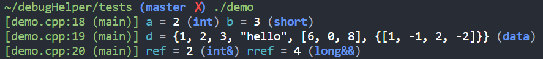
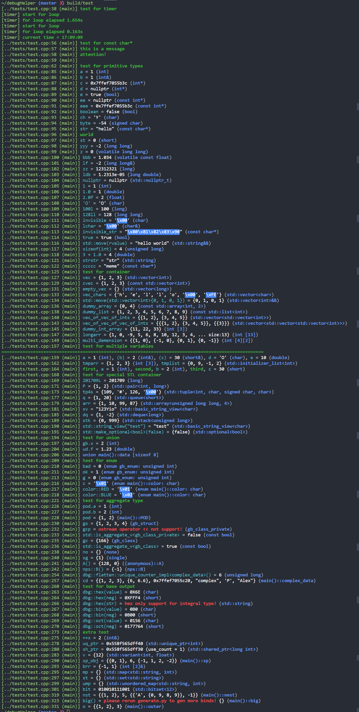

#### build
```shell
mkdir build && cd build
cmake .. // 如果只有c++17，或者只需要单参数，cmake -DSINGLE=on ..
make
```
#### demo
```cpp
#include "debug.hpp"
struct data {
  int a, b, c;
  std::string d;
};
int main() {
  int a = 2;
  short b = 3;
  int& ref = a;
  long&& rref = 4l;
  data d{1, 2, 3, "hello"};
#ifndef SINGLE
  dbg(a, b);
  dbg(d);
  dbg(ref, rref);
#else
  dbg(a); dbg(b);
  dbg(d);
  dbg(ref); dbg(rref);
#endif
  return 0;
}
```

### features
+ [x] 完整且正确的类型名称（包括const、volatile、左值引用、右值引用、数组、指针...）
+ [x] 支持可变参数
+ [x] 计时功能（timer，支持start、restart、stop、log、show）
+ [x] 默认输出到std::cerr，可以重定向cerr到文件，或者通过dbg::config::set_stream(os)修改输出流
+ [x] 可以对输出的颜色进行配置
+ [x] 在多参数模式下，支持空参数(dbg())
+ [x] 支持各种容器的输出(STL、原生数组...)
+ [x] 聚合类型(is_aggregate_v\<T\>)可以直接输出各个成员(无需自定义operator<<)。原理就是借助SFINAE、聚合类型初始化以及结构化绑定。

#### TODO
1. 2进制、8进制、16进制输出整数
2. for_each field?(may be)
3. more tests

#### weakness
1. 为了显示传入的语句，并且更好的输出类型，只能使用宏，而多参数需要借助FOR_EACH_MACRO，容易导致报错信息过多（与宏展开有关）。多参数宏为了解决空参数问题，使用了__VA_OPT__，所以至少需要-std=c++2a。可以通过-DSINGLE指明使用单参数，此时需要-std=c++17，但是不支持空参数。
2. 由于使用了宏，不支持直接传入初始化列表形式
```cpp
// not support!
dbg({1, 3, 4}); dbg(data{1, 2});
```
3. 聚合类型中包含原生数组还存在问题。 TODO!
```cpp
// example
struct st {
  int a[2];
};
```
4. 只支持unix，windows的colorize接口不一样
5. 对于不可打印字符(<0x20||>0x7f)，用unicode字符·('\u00b7')代替，字符串中不可打印字符还没有进行替换(是否有必要这么做，需要考虑)
6. 测试
#### thanks for
+ [magic-get](https://www.youtube.com/watch?v=abdeAew3gmQ) <https://github.com/boostorg/pfr>
+ dbg-macro <https://github.com/sharkdp/dbg-macro>

#### test
